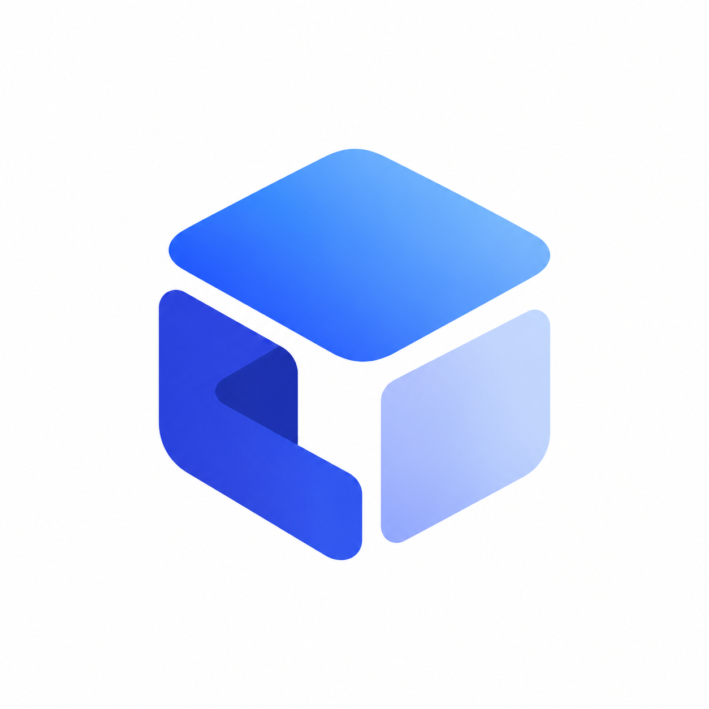

<p align="center">

</p>

<h1 align="center">tua</h1>

<p align="center">
Let your AI agent <b>see</b> and <b>control</b> your Android TV.
</p>

<p align="center">


</p>

## Features

- 📸 Screenshots and on-screen UI tree, like computer-use for your TV
- 🎮 D-pad navigation, remote keys, text input, taps and swipes
- 🚀 Launch apps, open deep links, search, play YouTube and Netflix
- 🔊 Volume, power and media control, plus what's playing now
- 🔌 Plain ADB over Wi-Fi, no app to install on the TV

## Setup

Install [`adb`](https://developer.android.com/tools/releases/platform-tools) and [`uv`](https://docs.astral.sh/uv/), turn on **Developer options → Network debugging** on your TV, then add the server to your MCP client:

```bash
claude mcp add android-tv -e TV_IP=192.168.1.10 -- uvx --from git+https://github.com/chann44/tua tv-mcp
```

<details>
<summary>Other clients</summary>

```json
{
  "mcpServers": {
    "android-tv": {
      "command": "uvx",
      "args": ["--from", "git+https://github.com/chann44/tua", "tv-mcp"],
      "env": { "TV_IP": "192.168.1.10" }
    }
  }
}
```

</details>

| Env        | Default        |
| ---------- | -------------- |
| `TV_IP`    | `192.168.1.10` |
| `TV_PORT`  | `5555`         |
| `ADB_PATH` | `adb` on PATH  |

Then just ask: *"put on lofi beats on YouTube and turn the volume down"*.

## License

[MIT](./LICENSE) License © 2026-PRESENT [chann44](https://github.com/chann44)
